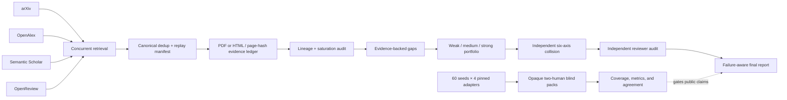

# Architecture

## Product boundary

Shushu Novelty Finder is a **lineage-first research novelty auditor**. It answers three
progressively stronger questions:

1. **Literature Lineage Map** — how a contribution family evolved and which contribution
   spaces are saturated.
2. **Novelty Candidate Portfolio** — which weak, medium, and strong candidates remain open.
3. **Reviewer-Defensible Research Plan** — what evidence, experiments, objections, and kill
   criteria determine whether a candidate should continue.

It is not a general paper-writing agent and does not attempt to reproduce ResearchStudio-Idea.
The Skill owns research judgment and interaction policy. The Python runtime owns deterministic
retrieval, schemas, provenance, persistence, phase gates, and evaluation.

Accepted decisions are recorded in:

- [`ADR 0001`](adr/0001-lineage-first-runtime.md): Skill judgment versus deterministic runtime;
- [`ADR 0002`](adr/0002-evidence-levels-fail-closed.md): evidence levels and strong-claim gates;
- [`ADR 0003`](adr/0003-human-primary-public-claims.md): blind human evidence for comparative claims.

## Run modes

- `lineage`: intake through gap audit, then a lineage report.
- `idea`: evidence-backed idea generation, collision checking, and reviewer audit.
- `full`: the complete lineage-first workflow.

## Data contracts

All durable records use `schema_version: "1.0"` and reject unknown fields. Public contracts cover
papers, full text, claims, gaps, ideas, lineage, collision, reviewer audits, benchmark runs,
identity-free evaluation assignments/responses, unblinded judgments, final-report manifests, and
run state.
They can be exported with `shushu schema <name>`.

Evidence invariants are enforced in code:

- every paper has at least one identifier and provenance record;
- `full-text` papers must be `verified`;
- `strong` claims require full-text supporting evidence;
- every claim has at least one paper evidence reference and every gap cites at least one claim;
- every idea identifies closest prior work and at least one kill criterion;
- reviewer context is isolated and at most one structural revision is permitted;
- a final report discloses failures, uncertainty, and known limitations;
- comparative effectiveness claims require a hashed, human-primary public evaluation.

## Runtime layout



```text
runs/<topic-time-id>/
├── run.json
├── intake/
├── retrieval/
├── papers/
├── lineage/
├── gaps/
├── ideas/
├── collision/
├── audit/
└── report/
```

`shushu next` inspects artifacts in phase order, validates the first existing artifact against
its gate, hashes completed output bundles, and returns exactly one next action. It never
overwrites a phase artifact. P2 binds canonical records to the replay manifest and durable
retrieval failure log. P3 binds extracted full text to the claim ledger and full-text failure log.
Legacy states can backfill missing bundle hashes only when their already-signed primary artifacts
are unchanged; later primary or auxiliary mutations fail closed.

P3 cross-checks `retrieval/papers.jsonl`, `papers/fulltext.jsonl`, and
`papers/claims.jsonl`. P4, P7, and P8 reuse those records for lineage, collision, and reviewer
cross-artifact gates. P9 validates `report/manifest.json`, which binds the Markdown report itself,
every mode-required input artifact, every declared failure log, and any public evaluation evidence
to SHA-256 hashes.

## Phase model

```text
P0 Intake
→ P1 Scope Narrowing
→ P2 Literature Retrieval
→ P3 Paper Verification
→ P4 Lineage Construction
→ P5 Gap Audit
→ P6 Idea Portfolio Generation
→ P7 Novelty Collision Check
→ P8 Reviewer Audit
→ P9 Final Report
```

Mode routing may skip phases, but it cannot bypass a gate within the selected route.

## Comparative evaluation boundary

`benchmark execute` invokes external systems through no-shell argv adapters, checks prompt and
adapter provenance hashes, atomically stores each output, and checkpoints the matrix after every
run. Repeating the same command resumes only if immutable run fields still match. `benchmark
blind-pack` then copies the assigned subset of the 240 hash-complete outputs into per-rater
directories with independent opaque labels and randomized left/right order. The recommended
balanced-overlap design collectively covers 60 seeds, shares 12 stratified seeds for agreement,
and normalizes shared ratings to one total seed weight; complete duplicate rating remains an
option. System identities remain in a coordinator-only key whose hash, together with every
rater-side artifact and the assignment plan, is bound in the package manifest until `benchmark
unblind` joins locked responses.
Scoring replays that join and binds blind responses, key, manifest, unblinded judgments, seeds, and
the completed run matrix plus its execution-environment manifest. Human completion and
research-experience claims cannot be automated by this runtime.

## Non-goals for v0.2

- Web UI, graph database, vector database service, or automatic paper writing;
- unbounded multi-agent orchestration;
- claims of research quality based only on an LLM judge;
- treating metadata or abstract matches as full-text evidence.
